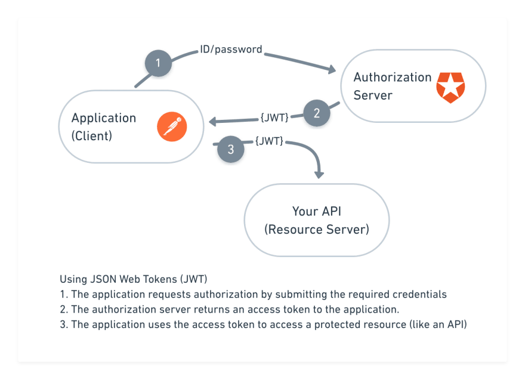

# Colorblind Plugin
@author: Maksym Gorbunov

Security inlogning application

* Java implementation of “PBKDF2” algorithm
* PBKDF2WithHmacSHA1
* JWT (Java Web Token)
* Java Authentication 
* Hashing Encoder with time controll  
* Spring Boot 2
* Security

  
